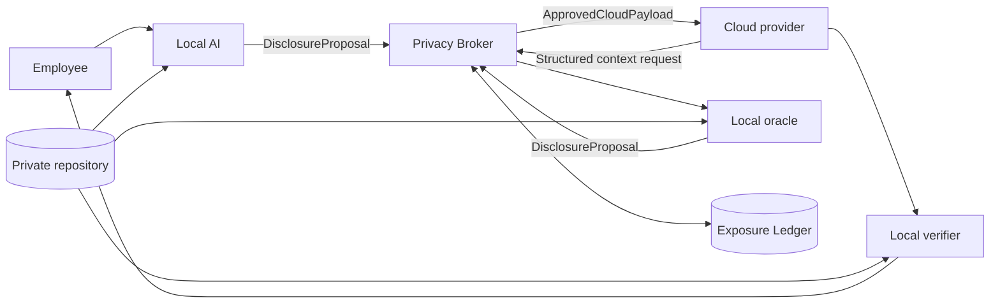

# Architecture

TrustSplit separates private computation, deterministic disclosure authority, and external reasoning. Cloud AI never directly accesses private corporate data.

## Components

- The FastAPI backend owns the synthetic private repository, policy, credential vault, orchestration state machine, and SQLite ledger.
- The React/Vite dashboard consumes only presentation-safe REST and SSE contracts.
- The Local AI creates disclosure proposals and verifies cloud recommendations against hidden constraints.
- The Privacy Broker is the sole disclosure authority. It applies hard-deny rules, generalisation, incremental reconstruction risk, and per-session budget.
- Cloud adapters accept only the frozen `ApprovedCloudPayload` type. They have no repository dependency.
- The Exposure Ledger stores safe representations and decision evidence, keyed by trust zone and protected entity. A new session resets budget but not long-term provider exposure.

## Workflow

The explicit state machine receives the private prompt, analyses locally, proposes a safe task, validates outbound disclosure, invokes cloud reasoning, mediates any context request twice, verifies locally, optionally requests one safe revision, and falls back to local synthesis on provider failure.

## Persistence

SQLAlchemy transactions write exposure claims, audit events, and budget changes atomically. Alembic owns the schema migration. SQLite uses foreign keys and WAL mode for the local POC.
